# Revision Selection

## Single Revisions
```bash
$ git show 1c002dd4b536e7479fe34593e72e6c6c1819e53b
$ git show 1c002dd4b536e7479f
$ git show 1c002d
```
- 40-character SHA-1 hash
- Short SHA-1
  `git log --abbrev-commit --pretty=oneline`
### Branch reference

branch name -> branch top commit id
```bash
$ git rev-parse <br> # plumbing tool
ca82a6dff817ec66f44342007202690a93763949
```


### RefLog Shortnames
reflog is a log of where your HEAD and branch references have been for the last few months.

```console
$ git reflog
734713b HEAD@{0}: commit: Fix refs handling, add gc auto, update tests
d921970 HEAD@{1}: merge phedders/rdocs: Merge made by the 'recursive' strategy.
1c002dd HEAD@{2}: commit: Add some blame and merge stuff
1c36188 HEAD@{3}: rebase -i (squash): updating HEAD
95df984 HEAD@{4}: commit: # This is a combination of two commits.
1c36188 HEAD@{5}: rebase -i (squash): updating HEAD
7e05da5 HEAD@{6}: rebase -i (pick): updating HEAD
```
Reflog is strictly local - it's a log only of what *you've* done in your repository.

Think of the reflog as Git’s version of shell history

### Ancestry References
The other main way to specify a commit is via its ancestry. If you place a `^` (caret) at the end of a reference, Git resolves it to mean the parent of that commit. Suppose you look at the history of your project:
```console
$ git log --pretty=format:'%h %s' --graph
* 734713b Fix refs handling, add gc auto, update tests
*   d921970 Merge commit 'phedders/rdocs'
|\
| * 35cfb2b Some rdoc changes
* | 1c002dd Add some blame and merge stuff
|/
* 1c36188 Ignore *.gem
* 9b29157 Add open3_detach to gemspec file list
```

You can see the previous commit by specifying `HEAD^`, which means “the parent of HEAD”. And you can specify a number after the `^` to identify *which* parent you want.
```console
$ git show HEAD^
commit d921970aadf03b3cf0e71becdaab3147ba71cdef
Merge: 1c002dd... 35cfb2b...
Author: Scott Chacon <schacon@gmail.com>
Date:   Thu Dec 11 15:08:43 2008 -0800

    Merge commit 'phedders/rdocs'
    
$ git show d921970^ # parent of d92
commit 1c002dd4b536e7479fe34593e72e6c6c1819e53b
Author: Scott Chacon <schacon@gmail.com>
Date:   Thu Dec 11 14:58:32 2008 -0800

    Add some blame and merge stuff

$ git show d921970^2 # second parent of d92
commit 35cfb2b795a55793d7cc56a6cc2060b4bb732548
Author: Paul Hedderly <paul+git@mjr.org>
Date:   Wed Dec 10 22:22:03 2008 +0000

    Some rdoc changes
```

The other main ancestry specification is the `~` (tilde). This also refers to the first parent, so `HEAD~` and `HEAD^` are equivalent. But the difference becomes apparent when you specify a number: `HEAD~2` means "the first parent of the first parent" -> "the grandparent".

You can also combine these syntaxes — you can get the second parent of the previous reference (assuming it was a merge commit) by using `HEAD~3^2`.

## Commit ranges

### Double dot
```bash
$ git log master..experiment
```
All commit `experiment` branch that hasn't yet been merged into `master`. `master..experiment` — that means “all commits reachable from `experiment` that aren’t reachable from `master`.”

If, on the other hand, you want to see the opposite — all commits in `master` that aren’t in `experiment` — you can reverse the branch names. `experiment..master` shows you everything in `master` not reachable from `experiment`
```bash
$ git log origin/master..HEAD
```

### Multiple Points

`^` `--not`
The following three commands are equivalent:
```bash
$ git log refA..refB
$ git log ^refA refB
$ git log refB --not refA
```
But with this syntax you can specify more than two references in your query:
```bash
$ git log refA refB ^refC
$ git log refA refB --not refC
```
### Triple Dot
`...`which specifies all the commits that are reachable by _either_ of two references but not by both of them.

A common swith to use with `log` command in this case is `--left-right`, which shows you which side of the range each commit is in.

# Interactive staging

`git add -i/--interactive`, Git enters an interactive shell mode, display something like this:
```console
$ git add -i
           staged     unstaged path
  1:    unchanged        +0/-1 TODO
  2:    unchanged        +1/-1 index.html
  3:    unchanged        +5/-1 lib/simplegit.rb

*** Commands ***
  1: [s]tatus     2: [u]pdate      3: [r]evert     4: [a]dd untracked
  5: [p]atch      6: [d]iff        7: [q]uit       8: [h]elp
What now>
```

## Staging patches
`git add -i` and input `p(atch)`, or `git add -p/--patch`

```bash
$ git reset --patch
$ git checkout --path
$ git stash save --patch
```

# Stashing and Cleaning
Motivation: Often, when you’ve been working on part of your project, things are in a messy state and you want to switch branches for a bit to work on something else.

Stashing takes the dirty state of your working directory — that is, your modified tracked files and staged changes — and saves it on a stack of unfinished changes that you can reapply at any time (even on a different branch).

To push a new stash onto your stack, run `git stash` or `git stash push`.
```bash
$ git stash list
stash@{0}: WIP on master: 049d078 Create index file
stash@{1}: WIP on master: c264051 Revert "Add file_size"
stash@{2}: WIP on master: 21d80a5 Add number to log

$ git stash apply [stash@{2}]
# if you don't specify a stash, git assume the most recent stash and tries to apply it
```
The changes to your files were reapplied, **but the file you staged before wasn’t restaged**. To do that, you must run the `git stash apply` command with a `--index` option to tell the command to try to reapply the staged changes. If you had run that instead, you’d have gotten back to your original position.

The `apply` option only tries to apply the stashed work — you continue to have it on your stack. To remove it, you can run `git stash drop` with the name of the stash to remove. You can also run `git stash pop` to apply the stash and then immediately drop it from your stack.

## Creative stashing
staged content excluded
> There are a few stash variants that may also be helpful. The first option that is quite popular is the `--keep-index` option to the `git stash` command. This tells Git to not only include all staged content in the stash being created, but simultaneously leave it in the index.

untracked files
> Another common thing you may want to do with stash is to stash the untracked files as well as the tracked ones. By default, `git stash` will stash only modified and staged _tracked_ files. If you specify `--include-untracked` or `-u`, Git will include untracked files in the stash being created. However, including untracked files in the stash will still not include explicitly _ignored_ files; to additionally include ignored files, use `--all` (or just `-a`).

stash patch
> Finally, if you specify the `--patch` flag, Git will not stash everything that is modified but will instead prompt you interactively which of the changes you would like to stash and which you would like to keep in your working directory.

## Creating a branch from a stash
You stash some work, and modified some file and committed, apply the stash maybe error (conflict). If you want an easier way to test the stashed changes again, you can run `git stash branch <new-br>`, which creates a new branch for you with your selected branch name, checks out the commit you were on when you stashed your work, reapplies your work there, and drops the stash if it applies successfully.

## Cleaning you working dir
Finally, you may not want to stash some work or files in your working directory, but simply get rid of them; that’s what the `git clean` command is for.

You’ll want to be pretty careful with this command, since it’s designed to remove files from your working directory that are not tracked. If you change your mind, there is often no retrieving the content of those files. A safer option is to run `git stash --all` to remove everything but save it in a stash.
# \*Signing your work
If you need to verify that commits are actually from a trusted source, git has a few ways to sign and verify work using GPG.

## GPG Introduction

First of all, if you want to sign anything you need to get GPG configured and your personal key installed.

```bash
$ gpg --list-keys
/Users/schacon/.gnupg/pubring.gpg
---------------------------------
pub   2048R/0A46826A 2014-06-04
uid                  Scott Chacon (Git signing key) <schacon@gmail.com>
sub   2048R/874529A9 2014-06-04
```

If you don’t have a key installed, you can generate one with `gpg --gen-key`.

```bash
$ gpg --gen-key
```

Once you have a private key to sign with, you can configure Git to use it for signing things by setting the `user.signingkey` config setting.

```bash
$ git config --global user.signingkey 0A46826A!
```

Now Git will use your key by default to sign tags and commits if you want.

We can **sign tags and individual commit.**

# Searching
## Git Grep (where)
```bash
# -n / --line-number to print out the line numbers
# -c / --count summarize the ouput
# -p / --show-function
$ git grep -n gmtime_r
$ git grep --break --heading \
    -n -e '#define' --and \( -e LINK -e BUF_MAX \) v1.8.0
```

## Git log searching (when)
If, for example, we want to find out when the `ZLIB_BUF_MAX` constant was originally introduced, we can use the `-S` option to tell Git to show us only those commits that changed the number of occurrences of that string.
```bash
$ git log -S ZLIB_BUF_MAX --oneline
```
If you need to be more specific, you can provide a regular expression to search for with the `-G` option.
### Line Log Search
`-L` will show you the history of a function or line of code in your codebase.

# Rewriting History
Don’t push your work until you’re happy with it.
## changing the last commit
`git commit --amend`

## changing multiple commit messages
`git rebase -i HEAD~3`

[git rebase in depth](https://git-rebase.io/)

## The Nuclear Option: filter-branch
一般不用，大量修改 commit ，比如所有 commit 中删除某个文件，或者修改大量 commit 中的 email 地址。

# Reset
`reset` `checkout`

## The Three Trees
An easier way to think about `reset` and `checkout` is through the mental frame of Git being a content manager of three different trees. By “tree” here, we really mean “collection of files”, not specifically the data structure. There are a few cases where the index doesn’t exactly act like a tree, but for our purposes it is easier to think about it this way for now.

Git as a system manages and manipulates three trees in its normal operation:

| Tree              | Role                              |
| ----------------- | --------------------------------- |
| HEAD              | Last commit snapshot, next parent |
| Index             | Proposed next commit snapshot     |
| Working Directory | Sandbox                           |
- HEAD is the pointer of the current branch reference, which is in turn a pointer to the last commit made on that branch.
- index is your proposed next commit, We’ve also been referring to this concept as Git’s “Staging Area".
- working directory, The other two trees store their content in an efficient but inconvenient manner, inside the `.git` folder. The working directory unpacks them into actual files, which makes it much easier for you to edit them.

### Workflow
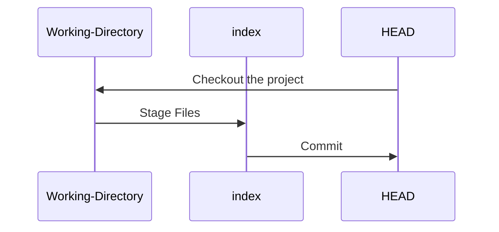

We touch one file `file.txt`
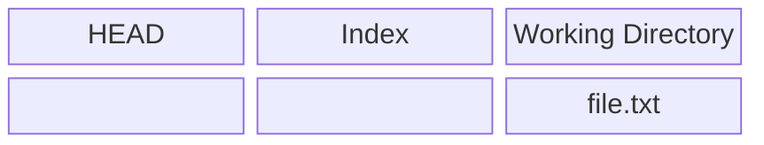

Now we want to commit this file, so we use `git add` to take content in the working directory and copy it to the index.
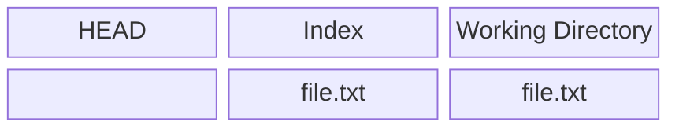
Then we run `git commit`, which takes the contents of the index and saves it as a permanent snapshot, creates a commit project which points to that snapshot, and update `master` to point to that commit
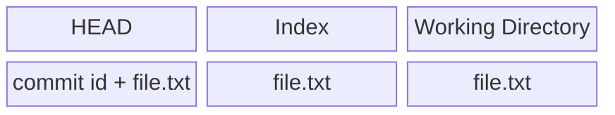

Now we run `git status`, we'll see no changes, because all threes are the same.

When you checkout a branch, it changes **HEAD** to point to the new branch ref, populates your **index** with the snapshot of that commit, then copied the contents of the **index** into your working directory.

## The role of Reset

The `reset` command makes more senses when viewed in this context.

Let's say that we've modified `file.txt` third times, so now our history looks like this:
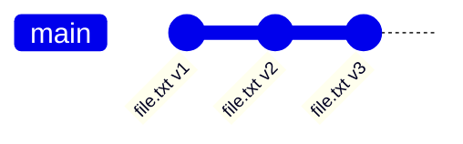
Let’s now walk through exactly what `reset` does when you call it. It directly manipulates these three trees in a simple and predictable way. It does up to three basic operations.

### step1: move HEAD
not same as chaning HEAD itself(which is what `checkout` does), `reset` move the branch that HEAD is pointing to.
`git reset --soft HEAD~`, with `--soft`, it will simply stop there
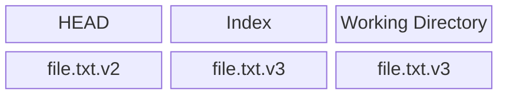

### step2: updating the index (--mixed)
Next thing `reset` will do is to update the index with contents of whatever snapshot HEAD now points to.
`git reset --mixed HEAD~` or `git reset HEAD~`
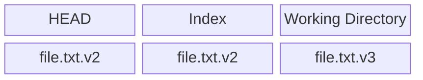
`--mixed` will stop at this point, this is also the default.
### step3: updating the working directory (--hard)
Third thing that `reset` will do is to make the working directory look like the index. if you use the `--hard` option, it will continue to this stage.

Note that **this flag --hard** is the only way to make `reset` command dangerous. Any other invocation of `reset` can be pretty easily undone.

## reset with a path
if you specify a path, `reset` will skip step1, and limit the remainder of its actions to a specific file or set of files. **HEAD is just a pointer, you can't point to part of one commit, but index and working directory can be partially used.**

We could just as easily not let Git assume we meant “pull the data from HEAD” by specifying a specific commit to pull that file version from. We would just run something like `git reset eb43bf file.txt`.

## Squashing by reset
```bash
# three commit into one 
$ git reset --soft HEAD~2
$ git commit -m "something"
```

## Checkout
### without paths
`git checkout <branch> ` is pretty similar to `git reset --hard <branch>`, but there two important differences:
- checkout is working directory safe
- how `checkout` updates HEAD, `reset` will move the branch that HEAD points to, `checkout` will move HEAD itself to point to another branch
  ![[/pics/Pasted image 20260307183618.png]]
### with paths
The other way to run `checkout` is with a file path, which, like `reset`, does not move HEAD. It is just like `git reset [branch] file` in that it updates the index with that file at that commit, but it also overwrites the file in the working directory. It would be exactly like `git reset --hard [branch] file` (if `reset` would let you run that) — it’s not working-directory safe, and it does not move HEAD.

## Summary
|                             | HEAD | Index | Workdir | WD Safe? |
| --------------------------- | ---- | ----- | ------- | -------- |
| **Commit Level**            |      |       |         |          |
| `reset --soft [commit]`     | REF  | NO    | NO      | YES      |
| `reset [commit]`            | REF  | YES   | NO      | YES      |
| `reset --hard [commit]`     | REF  | YES   | YES     | **NO**   |
| `checkout <commit>`         | HEAD | YES   | YES     | YES      |
| **File Level**              |      |       |         |          |
| `reset [commit] <paths>`    | NO   | YES   | NO      | YES      |
| `checkout [commit] <paths>` | NO   | YES   | YES     | **NO**   |
# Advanced Merging

If you wait too long to merge two branches that diverge quickly, you can run into some issues.
## merge conflicts
This is a lifesaver if you have someone on your team who likes to occasionally reformat everything from spaces to tabs or vice-versa. 这种方法会残留 DOS 空格字符
```bash
$ git merge -Xignore-space-change/-Xignore-all-space <br>
```

如果不使用这个 option，我们需要手动 re-merge

First，we get into the merge conflict state. Then we want to get copies of our version of the file.
```bash
$ git show :1:hello.rb > hello.common.rb
$ git show :2:hello.rb > hello.ours.rb
$ git show :3:hello.rb > hello.theirs.rb

$ dos2unix hello.theirs.rb
$ git merge-file -p \
   hello.ours.rb hello.common.rb hello.theirs.rb > hello.rb
```

To compare your result to what you had in your branch before the merge, in other words, to see what the merge introduced, you can run `git diff --ours`

If we want to see how the result of the merge differed from what was on their side, you can run `git diff --theirs`.

Finally, you can see how the file has changed from both sides with `git diff --base`.

We can use the `git clean` to clear out the extra files.
```bash
$ git clean -f
Removing hello.common.rb
Removing hello.ours.rb
Removing hello.theirs.rb
```
## checking out conflicts
Let’s change up the example a little. For this example, we have two longer lived branches that each have a few commits in them but create a legitimate content conflict when merged.

```bash
$ git log --graph --oneline --decorate --all
* f1270f7 (HEAD, master) Update README
* 9af9d3b Create README
* 694971d Update phrase to 'hola world'
| * e3eb223 (mundo) Add more tests
| * 7cff591 Create initial testing script
| * c3ffff1 Change text to 'hello mundo'
|/
* b7dcc89 Initial hello world code
```
We now have three unique commits that live only on the `master` branch and three others that live on the `mundo` branch. If we try to merge the `mundo` branch in, we get a conflict.

```bash
$ git merge mundo
Auto-merging hello.rb
CONFLICT (content): Merge conflict in hello.rb
Automatic merge failed; fix conflicts and then commit the result.
```

We would like to see what the merge conflict is. If we open up the file, we’ll see something like this:

```ruby
#! /usr/bin/env ruby

def hello
<<<<<<< HEAD
  puts 'hola world'
=======
  puts 'hello mundo'
>>>>>>> mundo
end

hello()
```

Both sides of the merge added content to this file, but some of the commits modified the file in the same place that caused this conflict.

One helpful tool is `git checkout` with the `--conflict` option. This will re-checkout the file again and replace the merge conflict markers. This can be useful if you want to reset the markers and try to resolve them again.

You can pass `--conflict` either `diff3` or `merge` (which is the default). If you pass it `diff3`, Git will use a slightly different version of conflict markers, not only giving you the “ours” and “theirs” versions, but also the “base” version inline to give you more context.

```bash
$ git checkout --conflict=diff3 hello.rb
```

Once we run that, the file will look like this instead:

```ruby
#! /usr/bin/env ruby

def hello
<<<<<<< ours
  puts 'hola world'
||||||| base
  puts 'hello world'
=======
  puts 'hello mundo'
>>>>>>> theirs
end

hello()
```

If you like this format, you can set it as the default for future merge conflicts by setting the `merge.conflictstyle` setting to `diff3`.

```bash
$ git config --global merge.conflictstyle diff3
```

The `git checkout` command can also take `--ours` and `--theirs` options, which can be a really fast way of just choosing either one side or the other without merging things at all.

This can be particularly useful for conflicts of binary files where you can simply choose one side, or where you only want to merge certain files in from another branch — you can do the merge and then checkout certain files from one side or the other before committing.

## Merge Log

Another useful tool when resolving merge conflicts is `git log`. This can help you get context on what may have contributed to the conflicts. Reviewing a little bit of history to remember why two lines of development were touching the same area of code can be really helpful sometimes.

To get a full list of all of the unique commits that were included in either branch involved in this merge, we can use the “triple dot” syntax that we learned in [[resource/git-scm/git_tools#Triple Dot| Triple Dot]].

```console
$ git log --oneline --left-right HEAD...MERGE_HEAD
< f1270f7 Update README
< 9af9d3b Create README
< 694971d Update phrase to 'hola world'
> e3eb223 Add more tests
> 7cff591 Create initial testing script
> c3ffff1 Change text to 'hello mundo'
```

That’s a nice list of the six total commits involved, as well as which line of development each commit was on.

We can further simplify this though to give us much more specific context. If we add the `--merge` option to `git log`, it will only show the commits in either side of the merge that touch a file that’s currently conflicted.

```console
$ git log --oneline --left-right --merge
< 694971d Update phrase to 'hola world'
> c3ffff1 Change text to 'hello mundo'
```

If you run that with the `-p` option instead, you get just the diffs to the file that ended up in conflict. This can be **really** helpful in quickly giving you the context you need to help understand why something conflicts and how to more intelligently resolve it.

You can also get this from the `git log` for **any merge to see how something was resolved after the fact.** Git will output this format if you run `git show` on a merge commit, or if you add a `--cc` option to a `git log -p` (which by default only shows patches for non-merge commits).

## Undoing merges
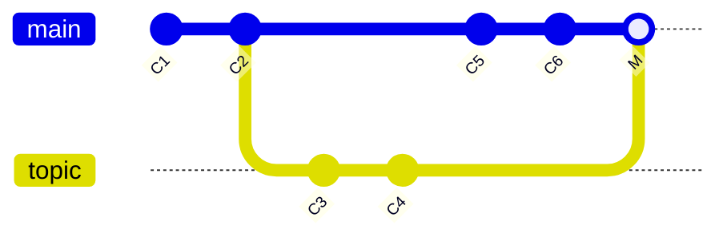

If the unwanted merge commit only exists on your local repository, the easiest and best solution is `git reset --hard HEAD~`, the branch would be like
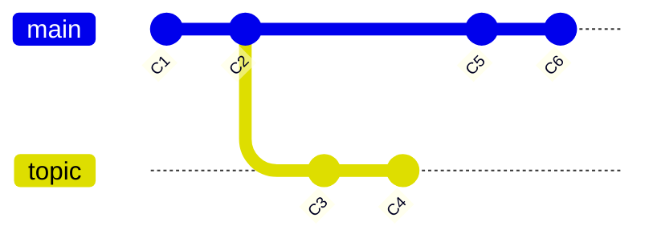

The downside of this approach is that it’s rewriting history, which can be problematic with a shared repository.
### revert commit
`$ git revert -m 1 HEAD` would add one commit and undo all last commit changes.
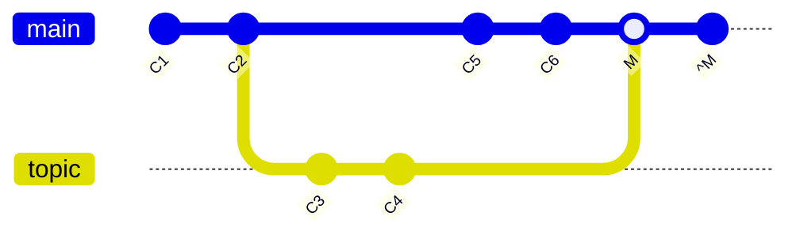

The new commit `^M`has exactly the same contents as `C6`. What's worse, if you add work to `topic` and merge again, Git will only bring in the changes since the reverted merge:

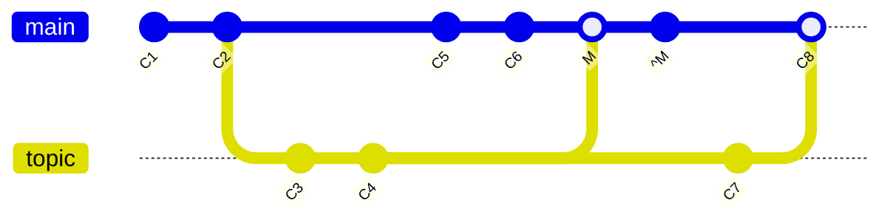

The content is bad, `C3` and `C4` in topic is not merged into `main`, wo the best way is to un-revert the original merge after `^M`
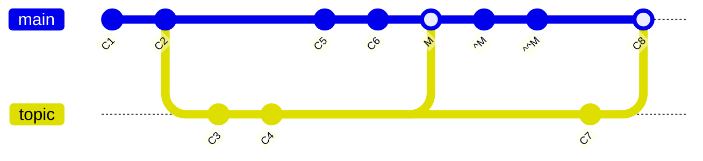
Now `topic` is fully merged.

## Our or Theirs
```bash
# only conflict pick ours or theirs
$ git merge -Xours <br>
$ git merge -Xtheirs <br>
# only use ours or theirs code but not merge actually, gen one merge commit
$ git merge -s ours <br>
$ git merge -s theirs <br>
```
`-s ours` This can often be useful to basically trick Git into thinking that a branch is already merged when doing a merge later on. 

## subtree merging
很少用，[link](https://git-scm.com/book/en/v2/Git-Tools-Advanced-Merging)

# Rerere
Reuse Recorded Resolution. As the name implies, it allows you to ask Git to remember how you’ve resolved a hunk conflict so that the next time it sees the same conflict, Git can resolve it for you automatically.


# Debugging with Git
## File Annotation (blame)
If you track down a bug in your code and want to know when it was introduced and why, file annotation is often your best tool.
```bash
$ git blame -L 69,82 Makefile
```
Another case, for example, say you are refactoring a file named `GITServerHandler.m` into multiple files, one of which is `GITPackUpload.m`. By blaming `GITPackUpload.m` with the `-C` option, you can see where sections of the code originally came from
```bash
git blame -C -L 141,153 GITPackUpload.m
f344f58d GITServerHandler.m (Scott 2009-01-04 141)
f344f58d GITServerHandler.m (Scott 2009-01-04 142) - (void) gatherObjectShasFromC
f344f58d GITServerHandler.m (Scott 2009-01-04 143) {
70befddd GITServerHandler.m (Scott 2009-03-22 144)         //NSLog(@"GATHER COMMI
ad11ac80 GITPackUpload.m    (Scott 2009-03-24 145)
ad11ac80 GITPackUpload.m    (Scott 2009-03-24 146)         NSString *parentSha;
ad11ac80 GITPackUpload.m    (Scott 2009-03-24 147)         GITCommit *commit = [g
ad11ac80 GITPackUpload.m    (Scott 2009-03-24 148)
ad11ac80 GITPackUpload.m    (Scott 2009-03-24 149)         //NSLog(@"GATHER COMMI
ad11ac80 GITPackUpload.m    (Scott 2009-03-24 150)
56ef2caf GITServerHandler.m (Scott 2009-01-05 151)         if(commit) {
56ef2caf GITServerHandler.m (Scott 2009-01-05 152)                 [refDict setOb
56ef2caf GITServerHandler.m (Scott 2009-01-05 153)
```
## Binary Search
The `bisect` command does a binary search through your commit history to help you identify as quickly as possible which commit introduced an issue.
```bash
$ git bisect start
$ git bisect bad
$ git bisect good v1.0
Bisecting: 6 revisions left to test after this
[ecb6e1bc347ccecc5f9350d878ce677feb13d3b2] Error handling on repo
# you test current commit, and it's good
$ git bisect good
Bisecting: 3 revisions left to test after this
[b047b02ea83310a70fd603dc8cd7a6cd13d15c04] Secure this thing
# you test, and it's bad
$ git bisect bad
Bisecting: 1 revisions left to test after this
[f71ce38690acf49c1f3c9bea38e09d82a5ce6014] Drop exceptions table
# test and it's good
$ git bisect good
b047b02ea83310a70fd603dc8cd7a6cd13d15c04 is first bad commit
commit b047b02ea83310a70fd603dc8cd7a6cd13d15c04
Author: PJ Hyett <pjhyett@example.com>
Date:   Tue Jan 27 14:48:32 2009 -0800

    Secure this thing

:040000 040000 40ee3e7821b895e52c1695092db9bdc4c61d1730
f24d3c6ebcfc639b1a3814550e62d60b8e68a8e4 M  config
# finish bisect, reset your HEAD
$ git bisect reset
```

Automated the program
```bash
$ git bisect start HEAD v1.0
$ git bisect run test-error.sh
```

Doing so automatically runs `test-error.sh` on each checked-out commit until Git finds the first broken commit. You can also run something like `make` or `make tests` or whatever you have that runs automated tests for you.

# Submodules

Submodules allow you to keep a Git repository as a subdirectory of another Git repository.

## Starting with submodules
```bash
$ git submodule add <url>
```
`.gitmodules` This is a configuration file that stores the mapping between the URL and the local subdirectory you've pulled it. Git see it as a **particular commit** from that repository.

You can overwrite this value local with `git config submodule.<sub>.url PRIVATE_URL`.

## Cloning a project with submodules
```bash
$ git clone <URL>
$ git submodule init
$ git submodule update

$ # or 
$ git clone --recurse-submodules <URL>
$ # or
$ git submodule update --init --recursive
```

## Working on a project with submodules
### Pulling in upstream changes from the submodule remote
```bash
$ # config diff
$ git config --global diff.submodule log
$ # config submodule branch, if you leave off the -f .gitmodules, it will only make the change for you
$ git config -f .gitmodules submodule.<sub>.branch stable
$ # show a short summary of changes to your submodules
$ git config status.submodulesummary 1

$ git submodule update --remote [<sub>]
```

### pulling upstream changes from the project remote
By default, `git pull` command recursively fetches submodules change. However, it does not update the submodules.

```bash
$ git pull
$ git submodule update --init --recursive
$ # equal below
$ git pull --recurse-submodules
```

if the submodule `<URL>` changed, you should `sync`:
```bash
# copy the new URL to your local config
$ git submodule sync --recursive
$ git submodule update --init --recursive
```

### working on a submodule
If you change local submodules files, and commit it. You update should add `--merge` or `--rebase` option. 

If you forget the `--rebase` or `--merge`, Git will just update the submodule to whatever is on the server and reset your project to a detached HEAD state.

#### publishing submodule changes
```bash
$ git push --recurse-submodules=check
The following submodule paths contain changes that can
not be found on any remote:
  DbConnector

Please try

	git push --recurse-submodules=on-demand

or cd to the path and use

	git push

to push them to a remote.

# config
$ git config push.recurseSubmodules check/on-demand
```
#### tips
```bash
# foreach
$ git submodule foreach 'git stash'
$ git submodule foreach 'git checkout -b featureA'
$ git diff; git submodule foreach 'git diff'

# useful aliases
$ git config alias.sdiff '!'"git diff && git submodule foreach 'git diff'"
$ git config alias.spush 'push --recurse-submodules=on-demand'
$ git config alias.supdate 'submodule update --remote --merge'

# git switch / checkout --recurse-submodules
# or
# git config submodule.recurse true
```

# Bundling
If you want to send that repository to someone and you don’t have access to a repository to push to, or simply don’t want to set one up, you can bundle it with `git bundle create`.

```bash
$ git bundle create repo.bundle HEAD master
Counting objects: 6, done.
Delta compression using up to 2 threads.
Compressing objects: 100% (2/2), done.
Writing objects: 100% (6/6), 441 bytes, done.
Total 6 (delta 0), reused 0 (delta 0)
```

Now you have a file named `repo.bundle` that has all the data needed to re-create the repository’s `master` branch. With the `bundle` command you need to list out every reference or specific range of commits that you want to be included. If you intend for this to be cloned somewhere else, you should add HEAD as a reference as well as we’ve done here.

You can email this `repo.bundle` file to someone else, or put it on a USB drive and walk it over.
On the other side, say you are sent this `repo.bundle` file and want to work on the project. You can clone from the binary file into a directory, much like you would from a URL.

```bash
$ git clone repo.bundle repo
Cloning into 'repo'...
...
$ cd repo
$ git log --oneline
9a466c5 Second commit
b1ec324 First commit
```

And you can bundle some commits.
```bash
$ git log --oneline master ^origin/master
71b84da Last commit - second repo
c99cf5b Fourth commit - second repo
7011d3d Third commit - second repo

$ git bundle create commits.bundle master ^9a466c5
Counting objects: 11, done.
Delta compression using up to 2 threads.
Compressing objects: 100% (3/3), done.
Writing objects: 100% (9/9), 775 bytes, done.
Total 9 (delta 0), reused 0 (delta 0)
```

When she gets the bundle, she can inspect it to see what it contains before she imports it into her repository. The first command is the `bundle verify` command that will make sure the file is actually a valid Git bundle and that you have all the necessary ancestors to reconstitute it properly.
```bash
$ git bundle verify ../commits.bundle
The bundle contains 1 ref
71b84daaf49abed142a373b6e5c59a22dc6560dc refs/heads/master
The bundle requires these 1 ref
9a466c572fe88b195efd356c3f2bbeccdb504102 second commit
../commits.bundle is okay
```

If the bundler had created a bundle of just the last two commits they had done, rather than all three, the original repository would not be able to import it, since it is missing requisite history. The `verify` command would have looked like this instead:

```bash
$ git bundle verify ../commits-bad.bundle
error: Repository lacks these prerequisite commits:
error: 7011d3d8fc200abe0ad561c011c3852a4b7bbe95 Third commit - second repo
```

However, our first bundle is valid, so we can fetch in commits from it. If you want to see what branches are in the bundle that can be imported, there is also a command to just list the heads:

```console
$ git bundle list-heads ../commits.bundle
71b84daaf49abed142a373b6e5c59a22dc6560dc refs/heads/master
```

The `verify` sub-command will tell you the heads as well. The point is to see what can be pulled in, so you can use the `fetch` or `pull` commands to import commits from this bundle. Here we’ll fetch the `master` branch of the bundle to a branch named `other-master` in our repository:

```bash
$ git fetch ../commits.bundle master:other-master
From ../commits.bundle
 * [new branch]      master     -> other-master
```

Now we can see that we have the imported commits on the `other-master` branch as well as any commits we’ve done in the meantime in our own `master` branch.

```console
$ git log --oneline --decorate --graph --all
* 8255d41 (HEAD, master) Third commit - first repo
| * 71b84da (other-master) Last commit - second repo
| * c99cf5b Fourth commit - second repo
| * 7011d3d Third commit - second repo
|/
* 9a466c5 Second commit
* b1ec324 First commit
```

So, `git bundle` can be really useful for sharing or doing network-type operations when you don’t have the proper network or shared repository to do so.
# Replace

