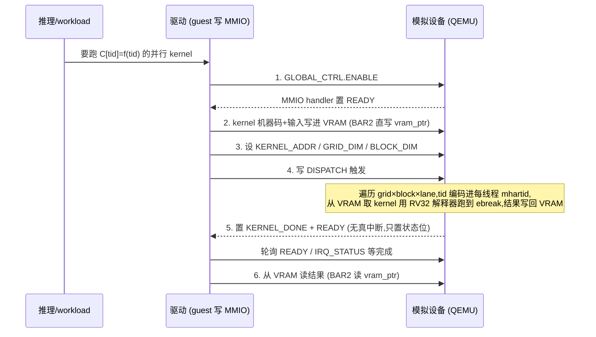
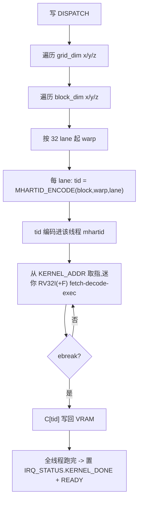

# overview kernel live cycle

```mermaid
sequenceDiagram
    participant W as 推理/workload
    participant D as 驱动 (guest 写 MMIO)
    participant G as 模拟设备 (QEMU)
    W->>D: 要跑 C[tid]=f(tid) 的并行 kernel
    D->>G: 1. GLOBAL_CTRL.ENABLE
    G-->>D: MMIO handler 置 READY
    D->>G: 2. kernel 机器码+输入写进 VRAM (BAR2 直写 vram_ptr)
    D->>G: 3. 设 KERNEL_ADDR / GRID_DIM / BLOCK_DIM
    D->>G: 4. 写 DISPATCH 触发
    Note over G: 遍历 grid×block×lane,tid 编码进每线程 mhartid,<br/>从 VRAM 取 kernel 用 RV32 解释器跑到 ebreak,结果写回 VRAM
    G-->>D: 5. 置 KERNEL_DONE + READY (无真中断,只置状态位)
    D->>G: 轮询 READY / IRQ_STATUS 等完成
    D->>G: 6. 从 VRAM 读结果 (BAR2 读 vram_ptr)
```

# DISPATH exe model (SIMT)

```mermaid
flowchart TD
    DISP["写 DISPATCH"] --> GRID["遍历 grid_dim x/y/z"]
    GRID --> BLK["遍历 block_dim x/y/z"]
    BLK --> WARP["按 32 lane 起 warp"]
    WARP --> LANE["每 lane: tid = MHARTID_ENCODE(block,warp,lane)"]
    LANE --> ENC["tid 编码进该线程 mhartid"]
    ENC --> INTERP["从 KERNEL_ADDR 取指,迷你 RV32I(+F) fetch-decode-exec"]
    INTERP --> EB{"ebreak?"}
    EB -- 否 --> INTERP
    EB -- 是 --> WB["C[tid] 写回 VRAM"]
    WB --> DONE["全线程跑完 -> 置 IRQ_STATUS.KERNEL_DONE + READY"]
```

